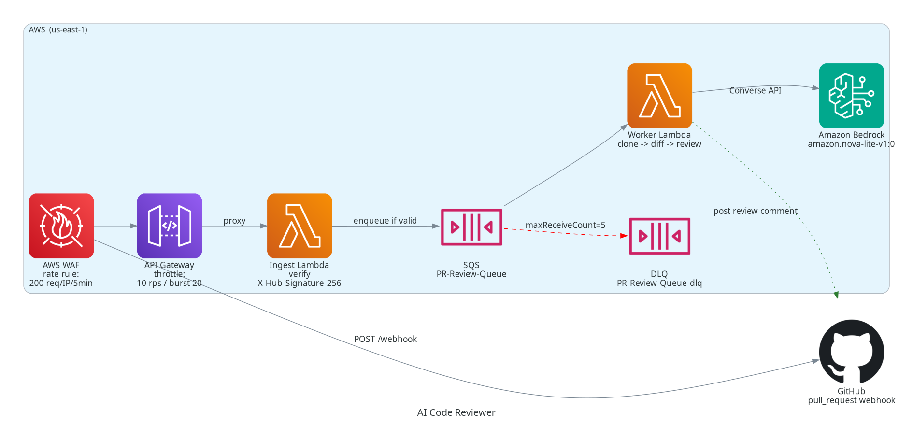

# AI Code Reviewer

A **production-hardened, fully-managed** serverless system that automatically reviews GitHub Pull Requests using Amazon Bedrock (Nova). It flags security vulnerabilities (hardcoded secrets, SQL injection, insecure CORS), code-quality issues, and performance problems, then posts actionable feedback as a comment on the PR — asynchronously, securely, and at low cost.

No waiting for human reviewers. No scaling worries. Deploy once, connect any repo, and let the AI review every PR.

---

## Architecture



### Flow

1. **GitHub** sends a webhook `POST` to our public endpoint.
2. **API Gateway** (rate-limited) forwards the raw body + headers to the **Ingest Lambda**.
3. **Ingest Lambda** verifies the GitHub `X-Hub-Signature-256` HMAC — **rejecting anything GitHub didn't actually sign** (401 on mismatch).
4. Validated payload is dropped onto **SQS** (with a **dead-letter queue** for poison messages). The webhook returns `200 OK` instantly — GitHub never waits on the AI.
5. **Worker Lambda** consumes the message, shallow-clones the PR branch, diffs the changes, and analyzes each changed code file with **Bedrock Nova**.
6. Robust findings are posted back to GitHub as an **inline PR comment**, and the message is removed from the queue.

---

## Repository layout

```
├── lambda/
│   ├── ingest.py                    # Webhook verifier (HMAC check + enqueue)
│   └── lambda_function.py           # PR review worker (SQS -> Bedrock -> GitHub)
├── cloudformation/
│   └── template.yaml                # Entire stack, defined once, deployable anywhere
├── deploy/
│   └── deploy.sh                    # Packages code -> uploads to S3 -> deploys stack
├── config/
│   └── model_config.yaml            # Where you choose the Bedrock model
├── docs/
│   └── architecture.py              # Regenerates architecture.png/.svg (official AWS icons)
├── .github/workflows/deploy.yml     # CI/CD: lint + auto-deploy on push to main
└── README.md
```

---

## Production hardening — the 5 upgrade areas

This project started as a working demo; these are the changes that make it production-safe.

### 1. Webhook signature verification ✅

**Problem:** previously any client that guessed the URL could inject a payload and burn your Bedrock tokens. Throttling limited *volume*, but not *who*.

**Fix:** a dedicated **Ingest Lambda** recomputes the HMAC-SHA256 of the raw request body using the webhook secret you configure in GitHub, and constant-time-compares it against the `X-Hub-Signature-256` header. Requests that GitHub didn't sign are rejected with `401`. Only traffic genuinely originating from GitHub can trigger a review.

> Configure the same secret in two places: (a) GitHub webhook settings, (b) the `--webhook-secret` deploy flag.

### 2. Secrets in AWS Secrets Manager ✅

**Problem:** the GitHub token lived in a Lambda env var and a CLI argument — visible in template dumps and shell history.

**Fix:** both the **GitHub token** and the **webhook secret** are now stored in **AWS Secrets Manager**. Lambdas fetch them at runtime (and cache them per warm invocation). Nothing sensitive is embedded in code, templates, or CI logs. Tokens can be rotated in place with no redeploy.

### 3. Dead-letter queue (DLQ) ✅

**Problem:** a failing message (say, an unparseable payload or a transient API error) was retried forever via the SQS visibility timeout — blocking the queue and jamming availability for legitimate reviews.

**Fix:** the source queue has a **RedrivePolicy** with `maxReceiveCount` (default **5**). After 5 failed attempts a message is moved to a **`-dlq`** queue where it can be inspected and replayed without stalling traffic. The DLQ URL is exposed as a stack output.

### 4. Continuous deployment (CI/CD) ✅

**Problem:** deploys were manual, unrepeatable, and depended on a developer's laptop.

**Fix:** a **GitHub Actions workflow** (`.github/workflows/deploy.yml`) that, on every push to `main`:
- **Lints** both Lambda files (`py_compile`) and the CloudFormation template (`cfn-lint`).
- **Deploys** via `deploy.sh` using OpenID Connect (no long-lived AWS keys in CI).
- Runs with **concurrency locking** so two pushes never collide.

Tokens arrive from GitHub **secrets** (`GITHUB_TOKEN_PAT`, `GITHUB_WEBHOOK_SECRET`); config values from **variables** (`BEDROCK_MODEL_ID`, `AWS_DEPLOY_ROLE_ARN`).

### 5. Observability & cost controls ✅

- **CloudWatch Alarms** on `Lambda Errors` (worker + ingest) and API `5XXError` — alert the moment something breaks.
- **AWS Budget** (default $50/mo) emails you when spend crosses the threshold → early warning on abuse or runaway usage.
- **X-Ray active tracing** on both Lambdas — see the API → SQS → Bedrock → GitHub call graph.
- **Structured JSON logs** for parseable, queryable CloudWatch Logs.

Plus the two abuse-protection layers from the original design, still enabled:

- **API Gateway stage throttling** — hard `requests/sec` and burst caps (defaults 10 / 20). Excess → `429`.
- **AWS WAF rate-based rule** — blocks a single client IP that exceeds N requests in 5 minutes (default 200).

---

## Model configuration (one place)

Edit `config/model_config.yaml` and pass `--model` to the deploy script. A single `BedrockModelId` parameter drives **both** the runtime invocation **and** the IAM permission ARN, so you change exactly one thing.

| Model | Trade-off |
|-------|-----------|
| `amazon.nova-pro-v1:0` | Most capable / higher cost |
| `amazon.nova-lite-v1:0` | Balanced speed & quality (recommended) |
| `amazon.nova-micro-v1:0` | Fastest / cheapest |

> **Before deploying:** enable the chosen model in the [Bedrock console](https://console.aws.amazon.com/bedrock) → *Model access*.

---

## Deployment

### Prerequisites

- AWS CLI authenticated with permission to create IAM roles, S3, Lambda, API Gateway, SQS, Secrets Manager, Bedrock, WAF, and Budgets.
- Python 3.9+ and `pip` (to build the `requests` layer), and `zip`.
- A **GitHub fine-grained PAT** (scopes: `Contents` read to clone, `Pull requests` read/write to post comments) for private repos.
- Your chosen **Bedrock model enabled** in *Model access*.

### One-shot deploy

```bash
chmod +x deploy/deploy.sh

./deploy/deploy.sh \
  --region us-east-1 \
  --stack-name pr-reviewer \
  --github-token 'github_pat_...' \
  --webhook-secret 'my-github-webhook-secret' \
  --model amazon.nova-lite-v1:0 \
  --allowlist 'your-org/myrepo' \
  --notify-email 'engineering@example.com'
```

### All deploy options

| Flag | Default | Purpose |
|------|---------|---------|
| `--region` | `us-east-1` | AWS region |
| `--stack-name` | `pr-reviewer` | CloudFormation stack name |
| `--github-token` | (none) | GitHub PAT (private repos) |
| `--webhook-secret` | (none) | GitHub webhook secret for HMAC verification |
| `--model` | `amazon.nova-lite-v1:0` (read from `config/model_config.yaml`) | Bedrock model ID |
| `--code-bucket` | auto-created | S3 bucket for packaged artifacts |
| `--rate-limit` | `10` | API requests/second |
| `--burst-limit` | `20` | API concurrent burst |
| `--waf-limit` | `200` | WAF requests/IP/5 min |
| `--max-receive-count` | `5` | SQS retries before DLQ |
| `--allowlist` | (all) | Comma-separated `org/repo` allowlist |
| `--budget` | `50` | Monthly USD spend budget |
| `--notify-email` | (none) | Email for budget/cost alerts |
| `--no-package` | off | Skip packaging/upload |
| `--dry-run` | off | Print the command and exit |

---

## Connecting a GitHub repository

1. GitHub → repo → **Settings → Webhooks → Add webhook**.
2. **Payload URL:** the `WebhookUrl` stack output.
3. **Content type:** `application/json`.
4. **Secret:** the same value you passed as `--webhook-secret`.
5. **Events:** choose *Let me select individual events* and tick **Pull requests**.
6. **Active:** on. **Save.**

Now every PR (opened / synchronized / reopened) is automatically reviewed. Output looks like:

```
## 🤖 AI Code Review

Found 2 issue(s):

🔴 **HIGH**: Hardcoded API key detected
🟡 **MEDIUM**: Unbounded loop on user-provided input

---
*Generated by Amazon Nova AI*
```

---

## CI/CD (recommended for real repos)

The included GitHub Actions workflow deploys automatically. To use it in **this** repository:

1. Create a **deploy role** in AWS that the workflow can assume via OIDC, and set:
   - `vars.AWS_DEPLOY_ROLE_ARN` — the role ARN.
2. Add **repository secrets**: `GITHUB_TOKEN_PAT` (your GitHub PAT) and `GITHUB_WEBHOOK_SECRET`.
3. Add **repository variables**: `BEDROCK_MODEL_ID`.

Push to `main` → linted → deployed. No manual step.

---

## Observability & ops

```bash
# Tail worker logs (structured JSON)
aws logs tail /aws/lambda/PR-Review-Worker --follow

# Find webhook rejections
aws logs filter-log-events \
  --log-group-name "API-Gateway-Execution-Logs_<api-id>/prod" \
  --filter-pattern 'INVALID_SIGNATURE|failed'

# Inspect dead-letter queue (why is it failing?)
aws sqs receive-message --queue-url "<DlqUrl stack output>"
```

- **Alarms:** `PR-Review-Worker-errors`, `PR-Review-Ingest-errors`, `PR-Reviewer-API-5xx`.
- **X-Ray:** open AWS X-Ray → trace map to follow one webhook end to end.
- **Budgets:** an email when spend crosses your configured monthly limit.

---

## Costs (approximate, per-use)

- **API Gateway:** ~$3.50 / 1M requests.
- **SQS:** ~$0.40 / 1M requests (after free tier).
- **Lambda:** CU-based; tiny per invocation (512 MB, up to 300 s).
- **Bedrock (Nova):** per-token — the dominant cost. Contained by throttling, WAF, a repo allowlist, and a per-PR cap of **10 files × 4000 chars**.

---

## Troubleshooting

| Symptom | Likely cause / fix |
|---------|--------------------|
| Webhook returns `401 Invalid webhook signature` | The `--webhook-secret` doesn't match the secret in GitHub webhook settings. |
| Webhook returns `429` | Over the rate/WAF limit — raise `--rate-limit` / `--waf-limit`. |
| `AccessDeniedException` from Bedrock | Model not enabled in *Model access*, or `--model` ≠ enabled model. |
| "Git clone failed" | Private repo missing a valid `--github-token`. |
| Messages stuck, not processed | Check the **DLQ**; a poison message may be redriving. |
| "Missing commit info, skipping" | Payload isn't a GitHub PR event — check webhook **Content type = application/json**. |

## License

MIT