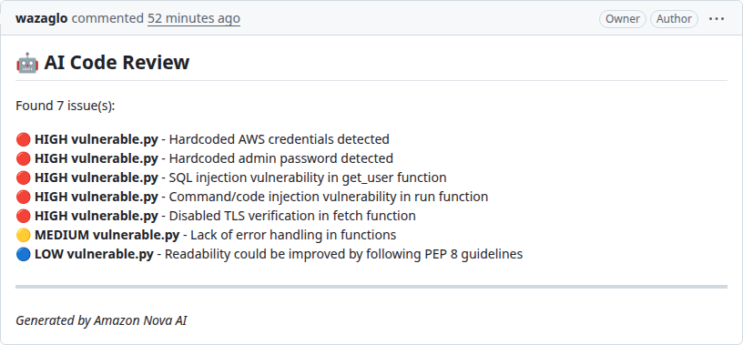
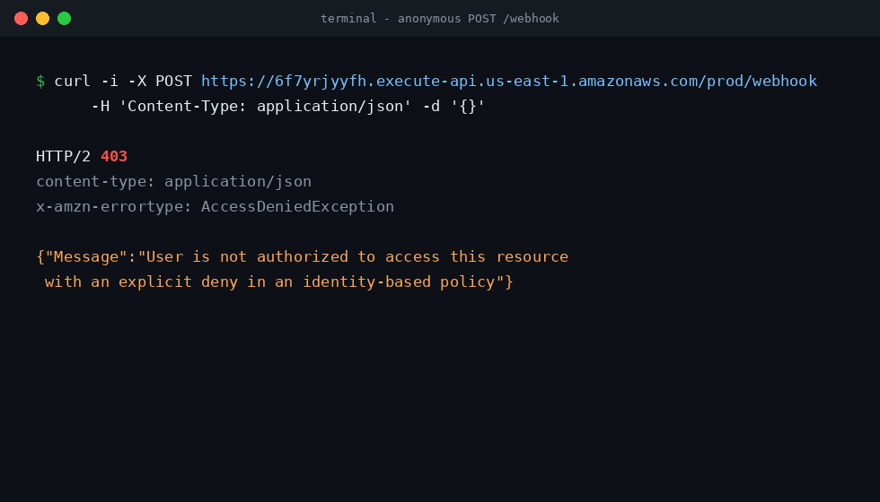

# AI Code Reviewer

Automatically reviews **GitHub Pull Requests** and **GitLab Merge Requests** with **Amazon Bedrock (Nova)**. Every PR/MR you open gets an AI comment flagging security holes (hardcoded secrets, SQL injection), code-quality issues, and performance problems, within seconds, for pennies.


## Use the hosted service

Want your repo reviewed by the instance I run? Email me at
[wazaglo87@gmail.com](mailto:wazaglo87@gmail.com) and I'll send you:

- the **payload URL**: the webhook endpoint for your repo's webhook settings
- the **webhook secret**: the signing secret your webhook must use (kept in
  AWS Secrets Manager on my side; one shared secret per provider per instance)
- a **Cognito user**, if you'd rather call the API directly

Then follow the steps in the [Endpoint](#endpoint) section below
("Connect a repo" or "Call the API yourself").

## How it works

Your Git provider sends a webhook → **API Gateway** (Cognito-protected, rate-limited) → **Ingest Lambda** verifies it's really from GitHub/GitLab → **SQS** queues it → **Worker Lambda** fetches the diff, asks **Bedrock Nova** for a review → posts the comment on your PR.

Live since Phase-A testing, sample of a real review:



## Endpoint

The live URL and IDs always come from the stack outputs:

```bash
aws cloudformation describe-stacks --stack-name pr-reviewer --region us-east-1 \
  --query 'Stacks[0].Outputs[].{key:OutputKey,value:OutputValue}' --output table
```

```
POST https://6f7yrjyyfh.execute-api.us-east-1.amazonaws.com/prod/webhook
```



*Fig 3: The endpoint rejecting an anonymous caller with 403, only authenticated API clients and verified Git webhooks get through*

Two ways to talk to it:

### 1. Connect a repo (no auth needed: recommended)

Webhooks from GitHub/GitLab are recognized automatically and don't need a token.

**GitHub:** repo → Settings → Webhooks → Add webhook

| Field | Value |
|-------|-------|
| Payload URL | the endpoint above |
| Content type | `application/json` |
| Secret | the value in AWS Secrets Manager (`WebhookSecret-...`) - must match |
| Events | **Pull requests** |

**GitLab:** project → Settings → Webhooks → URL above, trigger **Merge request events**, token = the GitLab secret in Secrets Manager. Enable **JSON body** on the hook if your GitLab version supports it (older form-encoded bodies are normalized automatically by the ingest function).

> Self-hosted note: the worker calls the GitLab API (fetch diffs, comment, merge/close).
> If your instance only resolves to a private IP, the Lambda needs a route to it
> (VPN/DX/PrivateLink or a public egress proxy), projects are addressed by their
> numeric ID from the webhook payload, which works with project access tokens.

Open a PR and watch the AI comment appear. That's it.

## For developers / deploying your own

```bash
git clone https://github.com/wazaglo/ai-code-reviewer
cd ai-code-reviewer
./deploy/deploy.sh --region us-east-1 --github-token 'ghp_...' --webhook-secret 'shared-secret'
```

- Model choice: single line in `config/model_config.yaml`
- Full IaC: `cloudformation/template.yaml`
- CI/CD: push to `main` → lint → deploy (`.github/workflows/deploy.yml`)
- Architecture diagram source: `docs/architecture.py` (`pip install diagrams`)

## Cost tracking

Every PR review is tracked in DynamoDB with:
- Input/output tokens used
- Processing time (ms)
- Files analyzed
- USD cost
- Number of findings

Cost attribution keys: `provider:repo:month` (partition) and `PR:{number}` (sort).

## Auto-merge / Auto-close behavior

The worker can automatically merge or close PRs based on review severity:

| Condition | Action | Environment Variable |
|-----------|--------|---------------------|
| No high-severity issues | Merge | `MERGE_ON_LOW_SEVERITY=true` (default) |
| No high-severity issues | Merge | `MERGE_ON_MEDIUM_SEVERITY=true` (default: false) |
| High-severity issues found | Close | `CLOSE_ON_HIGH_SEVERITY=true` (default) |

To customize, set environment variables in the Worker Lambda:

```yaml
Environment:
  Variables:
    MERGE_ON_LOW_SEVERITY: 'false'
    MERGE_ON_MEDIUM_SEVERITY: 'true'
    CLOSE_ON_HIGH_SEVERITY: 'true'
```

## Troubleshooting

| Symptom | Fix |
|---------|-----|
| Webhook 401 | Hook **Secret** doesn't match the Secrets Manager value |
| API call 403 | Missing/expired `Authorization: Bearer <token>` |
| 429 | Over rate limit - slow down |
| No AI comment | Check Lambda logs: `aws logs tail /aws/lambda/PR-Review-Worker --follow` |
| Auto-merge not working | Check that `GITHUB_TOKEN` or `GITLAB_TOKEN` has write permissions |

## License

MIT
